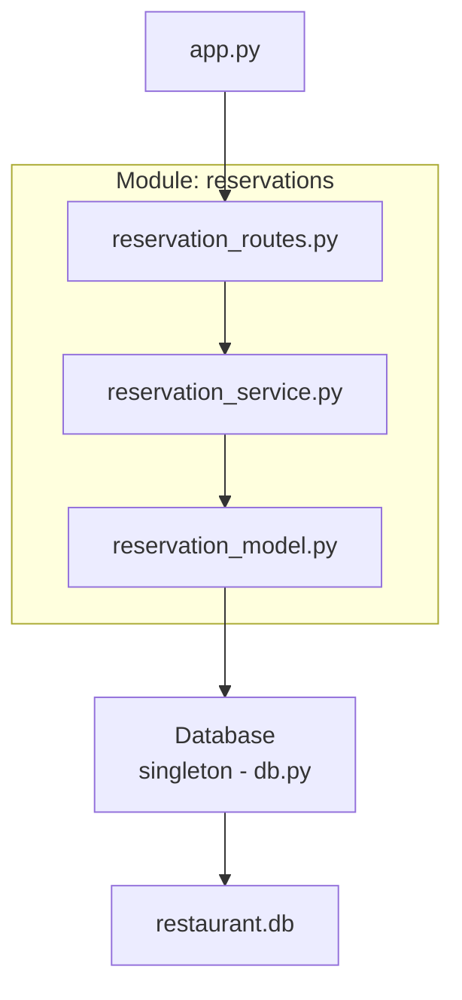
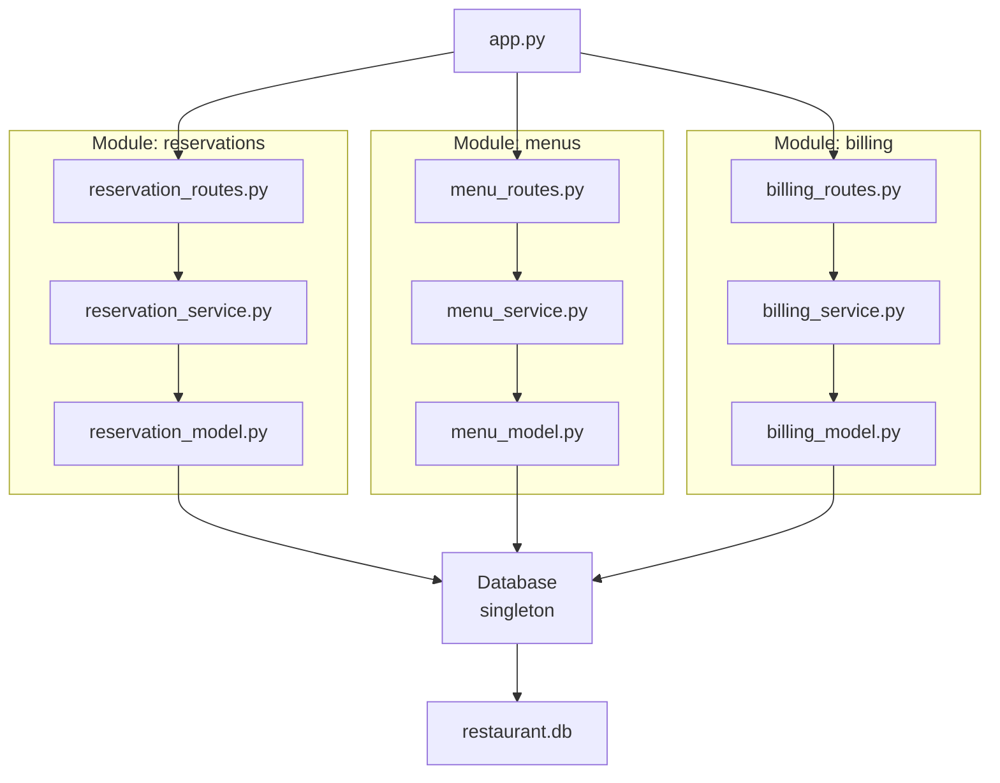

# En clase

## 🔁 Antes del refactor: Código monolítico

En el diseño inicial, toda la lógica (rutas, persistencia, validación, conexión a base de datos) estaba concentrada en un único archivo `app.py`. Esto violaba varios principios fundamentales del buen diseño de software:

- ❌ Violación del **principio de responsabilidad única (SRP)**.
- ❌ Acoplamiento fuerte entre capa de presentación, lógica de negocio y persistencia.
- ❌ Baja cohesión interna.
- ❌ Dificultad para testear, escalar o delegar partes del sistema.

Esto hacía que cualquier cambio —por pequeño que fuera— pudiera romper funcionalidades no relacionadas.

## ✅ Después del refactor: Modularización horizontal

La aplicación fue reorganizada en **módulos funcionales**, cada uno con una única responsabilidad clara.

| Archivo                    | Responsabilidad                                      |
|----------------------------|------------------------------------------------------|
| `reservation_model.py`     | Acceso y manipulación de datos (persistencia)       |
| `reservation_service.py`   | Lógica de negocio y validación                      |
| `reservation_routes.py`    | Interfaz HTTP (controladores y endpoints)           |
| `db.py`                    | Singleton para la conexión con la base de datos     |
| `app.py`                   | Inicialización de la app y registro de los módulos  |

Cada módulo sigue el principio de **alta cohesión** y **bajo acoplamiento**.

---

## 📐 Modularidad en una arquitectura monolítica

Aunque la aplicación es un **monolito** (una sola unidad desplegable), la modularización permite:

- ✅ Trabajar por features o dominios funcionales.
- ✅ Escalar el código sin caer en desorden.
- ✅ Reutilizar módulos y aplicar tests unitarios fácilmente.
- ✅ Migrar a microservicios en el futuro si fuera necesario.

### Asignación

Desarrollar un sistema **monolítico modular** para un restaurante, dividido en tres módulos funcionales, usando un microframework y lenguaje de tu preferencia.

La arquitectura debe estar organizada por **dominios funcionales**, siguiendo principios de **alta cohesión** y **bajo acoplamiento**, replicando el patrón de modularización horizontal aprendido en clase.

## 📦 Módulos requeridos

### 1. `reservations/` – Gestión de reservas
- Registrar una reserva con:
  - Nombre del cliente
  - Fecha y hora
  - Número de personas
- Consultar todas las reservas realizadas.

### 2. `menus/` – Gestión de la carta
- Registrar platos en el menú con:
  - Nombre
  - Precio
- Consultar todos los platos disponibles.

### 3. `billing/` – Generación de cuentas
- Generar una cuenta final para una reserva:
  - Se ingresan los platos consumidos.
  - Se calcula el total.
  - Marca la reserva como pagada.