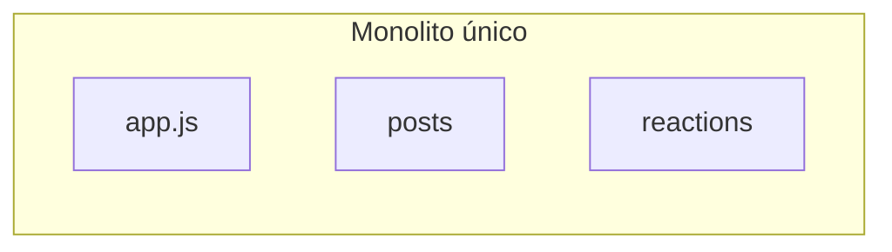
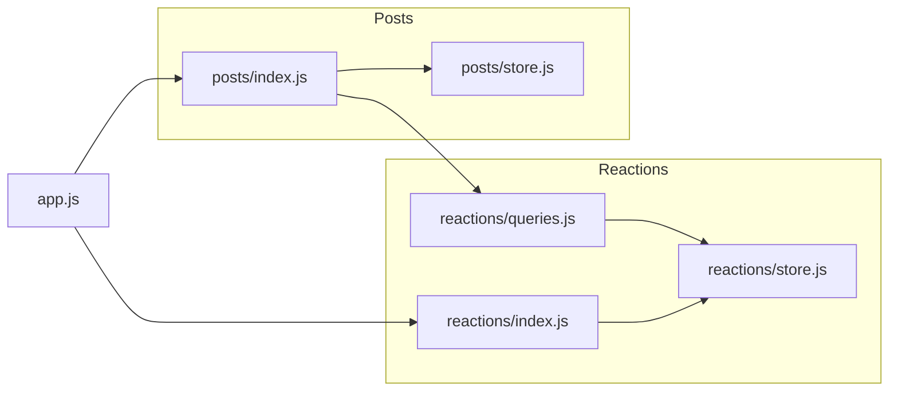

Este proyecto muestra cómo refactorizar una aplicación Express sencilla para aplicar dos principios fundamentales del diseño de software:

- ✅ **Alta cohesión**: cada módulo hace una sola cosa y la hace bien.
- ✅ **Bajo acoplamiento**: los módulos colaboran sin depender internamente unos de otros.

---

## 🎯 Objetivo

Crear un sistema en Express que permita:

- Crear publicaciones (`POST /posts`)
- Reaccionar a publicaciones (`POST /reactions`)
- Consultar un post con sus reacciones (`GET /posts/:id`)

---

## 🧱 Antes del refactor (mal diseño)



Toda la lógica estaba en un solo archivo `app.js`:

- Las rutas de `/posts` y `/reactions` accedían a datos globales.
- No había separación por dominios funcionales.
- Las responsabilidades estaban mezcladas.
- Si cambiabas la estructura de `posts`, rompías las reacciones.

---


## ✅ Después del refactor



El sistema fue reorganizado por **módulos funcionales**, cada uno con su propia responsabilidad:

### 🔍 Alta cohesión

- El módulo `posts/` se encarga exclusivamente de gestionar publicaciones.
- El módulo `reactions/` se encarga exclusivamente de las reacciones.
- Cada módulo mantiene sus propios datos en `store.js`.

---

### 🔗 Bajo acoplamiento

- `posts/index.js` no conoce la estructura interna de `reactions/`, solo usa su interfaz:
  ```js
  const { getReactionsByPostId } = require('../reactions/queries');